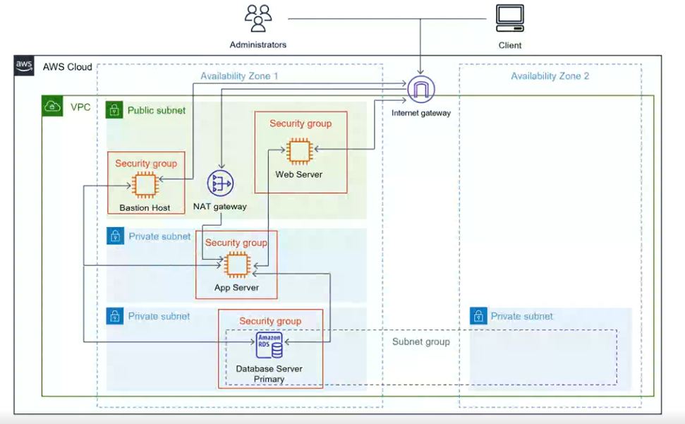

# 3tier cloud architecture


# AWS 3-Tier Architecture Setup Guide

This guide provides step-by-step instructions to create a 3-tier architecture in AWS, including VPCs, subnets, security groups, servers, and a database. Follow the steps below to set up your environment.

---
## Overview

A 3-tier architecture typically consists of three layers:
1. **Web Tier (Public Subnet):** A bastion host and web servers accessible from the internet.
2. **Application Tier (Private Subnet):** Application servers to handle business logic.
3. **Database Tier (Private Subnet):** A database server for storing data.

### Architecture Diagram

Include the uploaded architecture diagram here (placeholder):



## Step 1: Create a VPC and Subnets

### 1.1 Create a VPC
1. Navigate to "Your VPCs" in the AWS Management Console.
2. Click the orange "Create VPC" button.
3. Assign a name to your VPC (e.g., `MyLabVPC`).
4. Use `192.168.0.0/16` as the CIDR block.
5. Leave other settings as default and click "Create".

### 1.2 Create Subnets
1. Navigate to "Subnets" in the VPC service.
2. Add four subnets:
   - **Public Subnet 1**: Availability Zone 1, CIDR `192.168.1.0/24`.
   - **Private Subnet 1**: Availability Zone 1, CIDR `192.168.2.0/24`.
   - **Private Subnet 2**: Availability Zone 1, CIDR `192.168.3.0/24`.
   - **Private Subnet 3**: Availability Zone 2, CIDR `192.168.4.0/24`.

### 1.3 Set Up Route Tables
1. Allocate an Elastic IP address:
   - Go to "Elastic IPs" and click "Allocate Elastic IP address".
2. Create an Internet Gateway:
   - Go to "Internet Gateways" and click "Create Internet Gateway".
   - Attach the gateway to your VPC.
3. Create a NAT Gateway:
   - Assign it to Public Subnet 1.
   - Use the Elastic IP created earlier.
4. Create two route tables:
   - **Public Route Table**: Associate it with Public Subnet 1.
     - Add a route: Destination `0.0.0.0/0`, Target `Internet Gateway`.
   - **Private Route Table**: Associate it with Private Subnets 1, 2, and 3.
     - Add a route: Destination `0.0.0.0/0`, Target `NAT Gateway`.

---

## Step 2: Configure Security Groups

### 2.1 Bastion Host Security Group
1. Name: `BastionHostSG`.
2. Inbound Rules:
   - SSH: Source = Your IP.
   - HTTP: Source = `0.0.0.0/0`.
   - HTTPS: Source = `0.0.0.0/0`.

### 2.2 Web Server Security Group
1. Name: `WebServerSG`.
2. Inbound Rules:
   - Same as Bastion Host.

### 2.3 App Server Security Group
1. Name: `AppServerSG`.
2. Inbound Rules:
   - All ICMP - IPv4: Source = `WebServerSG`.
   - SSH: Source = `BastionHostSG`.

### 2.4 Database Security Group
1. Name: `DatabaseSG`.
2. Inbound Rules:
   - MySQL/Aurora: Source = `AppServerSG`.
   - MySQL/Aurora: Source = `BastionHostSG`.

---

## Step 3: Create Servers

### 3.1 Bastion Host
1. AMI: Amazon Linux 2.
2. Instance Type: `t2.micro`.
3. Subnet: Public Subnet 1. Enable Auto-Assign Public IP.
4. Security Group: `BastionHostSG`.
5. Key Pair: Use an existing key pair.

### 3.2 Web Server
1. Follow the same steps as Bastion Host until Step 3.
2. User Data:
   ```bash
   #!/bin/bash
   sudo yum update -y
   sudo amazon-linux-extras install -y lamp-mariadb10.2-php7.2 php7.2
   sudo yum install -y httpd
   sudo systemctl start httpd
   sudo systemctl enable httpd
   ```
3. Security Group: `WebServerSG`.

### 3.3 App Server
1. Subnet: Private Subnet 1. Disable Auto-Assign Public IP.
2. User Data:
   ```bash
   #!/bin/bash
   sudo yum install -y mariadb-server
   sudo service mariadb start
   ```
3. Security Group: `AppServerSG`.

---

## Step 4: Create a Database

### 4.1 DB Subnet Group
1. Go to "Amazon RDS" and click "Subnet Groups".
2. Create a subnet group:
   - Name: `DBSubnetGroup`.
   - VPC: Use your VPC.
   - Subnets: Private Subnets 2 and 3.

### 4.2 Create Database
1. Engine: MariaDB.
2. Free Tier.
3. Identifier: `MyDatabase`.
4. Master Username: `root`.
5. Password: Write down securely.
6. Assign Security Group: `DatabaseSG`.
7. Subnet Group: `DBSubnetGroup`.

---

## Step 5: Test Connections

### 5.1 Upload Keys to Bastion Host
1. Use `pscp` to upload PEM and PPK files from your local powershell:
   ```bash
   pscp -scp -P 22 -i .\Downloads\labsuser.ppk .\Downloads\labsuser.pem ec2-user@<Bastion-Host-Public-IP>:/home/ec2-user
   ```

### 5.2 Connect to App Server
1. SSH into Bastion Host:
   ```bash
   ssh -i labsuser.pem ec2-user@<Bastion-Host-Public-IP>
   ```
2. From Bastion Host, SSH into App Server:
   ```bash
   ssh -i labsuser.pem ec2-user@<App-Server-Private-IP>
   ```

### 5.3 Test Database Connection
1. Connect to the database:
   ```bash
   mysql --user=root --password='YourPassword' --host=<Database-Endpoint>
   ```
2. Verify connection:
   ```sql
   SHOW DATABASES;
   ```

---

This concludes the setup of your 3-tier architecture.


